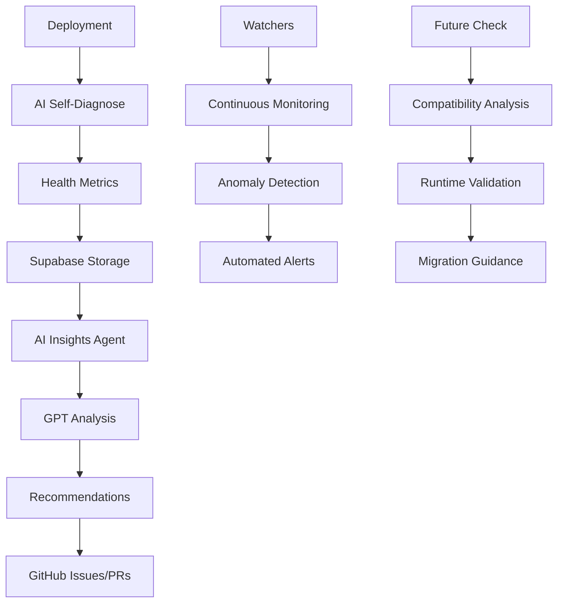

# AI Automation System

## Overview

The AI Automation System is a comprehensive suite of tools and processes that enable self-maintaining, AI-driven operations for the Whats-for-Dinner monorepo. This system provides intelligent monitoring, automated optimization, and predictive maintenance capabilities.

## Architecture

### Core Components

```
ai/
├── self_diagnose.ts          # Health monitoring and diagnostics
├── insights_agent.mjs        # AI-powered analysis and recommendations
├── ai_autoscale.ts          # Auto-scaling and cost management
├── privacy_guard.ts         # Privacy protection and compliance
└── agent_config.json        # Configuration and settings

watchers/
├── db_integrity.watcher.ts  # Database integrity monitoring
├── api_contract.watcher.ts  # API contract validation
└── ai_performance.watcher.ts # AI performance tracking

scripts/
├── futurecheck.ts           # Future runtime compatibility
└── generate-embeddings.mjs  # Vector embeddings generation
```

### Data Flow



## Features

### 1. AI Self-Diagnosis

**Purpose**: Monitors system health and automatically detects issues

**Capabilities**:
- Error rate monitoring
- Performance degradation detection
- Cold start analysis
- Latency tracking
- Memory and CPU usage monitoring

**Outputs**:
- Health metrics stored in Supabase
- GitHub issues for critical problems
- Automated recommendations

### 2. AI Insights Agent

**Purpose**: Provides intelligent analysis and optimization recommendations

**Capabilities**:
- Log analysis with GPT-5 reasoning
- Performance bottleneck identification
- Optimization recommendations
- PR comment generation

**Outputs**:
- Structured analysis reports
- Actionable recommendations
- Automated PR comments

### 3. Auto-Scaling & Cost Management

**Purpose**: Optimizes resource usage and manages costs

**Capabilities**:
- Usage pattern analysis
- Cost prediction with linear regression
- Budget deviation alerts
- Scaling recommendations

**Outputs**:
- Cost analysis reports
- GitHub discussions for budget alerts
- Scaling recommendations

### 4. Privacy Guard

**Purpose**: Ensures privacy compliance and data protection

**Capabilities**:
- PII detection and redaction
- Data anonymization
- Privacy compliance validation
- GDPR/CCPA compliance

**Outputs**:
- Privacy compliance reports
- Data sanitization
- Compliance alerts

### 5. Future Runtime Readiness

**Purpose**: Ensures compatibility with future runtimes

**Capabilities**:
- Edge Runtime validation
- WASM compatibility checking
- Workers compatibility
- Hydrogen/Oxygen bridge

**Outputs**:
- Compatibility reports
- Migration guidance
- Runtime validation

## Autonomous Watchers

### Database Integrity Watcher

**Schedule**: Nightly at 1 AM UTC

**Checks**:
- Foreign key constraints
- Data type consistency
- Null constraints
- Unique constraints
- Check constraints

**Actions**:
- Creates GitHub issues for violations
- Generates integrity reports
- Provides remediation guidance

### API Contract Watcher

**Schedule**: Nightly at 1 AM UTC

**Checks**:
- OpenAPI spec vs deployed endpoints
- Breaking changes detection
- Parameter validation
- Response schema validation

**Actions**:
- Identifies contract violations
- Creates GitHub issues for breaking changes
- Provides migration guidance

### AI Performance Watcher

**Schedule**: Nightly at 1 AM UTC

**Checks**:
- Token usage tracking
- Latency monitoring
- Cost analysis
- Error rate tracking

**Actions**:
- Performance trend analysis
- Cost optimization recommendations
- Performance alerts

## CI/CD Integration

### AI Audit Workflow

**Schedule**: Weekly on Sundays at 2 AM UTC

**Jobs**:
1. AI Health Audit
2. AI Insights Analysis
3. AI Cost Analysis
4. Privacy Compliance Check

**Outputs**:
- Comprehensive audit reports
- GitHub issues for critical problems
- Automated recommendations

### Future Check Workflow

**Schedule**: Daily at 3 AM UTC

**Jobs**:
1. Future Runtime Check
2. Edge Runtime Validation
3. WASM Compatibility Check
4. Workers Compatibility Check
5. Hydrogen/Oxygen Bridge

**Outputs**:
- Compatibility reports
- Migration guidance
- Runtime validation

### Watcher Cron Workflow

**Schedule**: Nightly at 1 AM UTC

**Jobs**:
1. Database Integrity Watcher
2. API Contract Watcher
3. AI Performance Watcher

**Outputs**:
- Monitoring reports
- Automated alerts
- Issue creation

## Configuration

### Agent Configuration

```json
{
  "project_ref": "ghqyxhbyyirveptgwoqm",
  "embeddings_table": "ai_embeddings",
  "models": {
    "chat": "gpt-4-turbo-preview",
    "embedding": "text-embedding-3-small",
    "analysis": "gpt-4-turbo-preview"
  },
  "refresh_interval_days": 7,
  "monitoring": {
    "error_rate_threshold": 3.0,
    "latency_p95_threshold": 500,
    "memory_usage_threshold": 80,
    "cpu_usage_threshold": 70
  }
}
```

### Environment Variables

```bash
# Supabase Configuration
SUPABASE_URL=https://ghqyxhbyyirveptgwoqm.supabase.co
SUPABASE_ANON_KEY=your_anon_key
SUPABASE_PROJECT_REF=ghqyxhbyyirveptgwoqm

# AI Services
OPENAI_API_KEY=your_openai_key

# GitHub Integration
GITHUB_TOKEN=your_github_token
GITHUB_OWNER=your_org
GITHUB_REPO=whats-for-dinner-monorepo

# Cost Management
BUDGET_THRESHOLD_PERCENT=20
```

## Database Schema

### AI Health Metrics

```sql
CREATE TABLE ai_health_metrics (
  id UUID DEFAULT gen_random_uuid() PRIMARY KEY,
  timestamp TIMESTAMP WITH TIME ZONE DEFAULT NOW(),
  deploy_id TEXT NOT NULL,
  environment TEXT NOT NULL,
  metrics JSONB NOT NULL,
  patterns JSONB NOT NULL,
  recommendations JSONB NOT NULL,
  status TEXT NOT NULL,
  created_at TIMESTAMP WITH TIME ZONE DEFAULT NOW()
);
```

### AI Embeddings

```sql
CREATE TABLE ai_embeddings (
  id UUID DEFAULT gen_random_uuid() PRIMARY KEY,
  namespace TEXT NOT NULL,
  content TEXT NOT NULL,
  embedding VECTOR(1536),
  metadata JSONB DEFAULT '{}',
  created_at TIMESTAMP WITH TIME ZONE DEFAULT NOW(),
  updated_at TIMESTAMP WITH TIME ZONE DEFAULT NOW()
);
```

### AI Insights

```sql
CREATE TABLE ai_insights (
  id UUID DEFAULT gen_random_uuid() PRIMARY KEY,
  deploy_id TEXT NOT NULL,
  analysis JSONB NOT NULL,
  recommendations JSONB NOT NULL,
  created_at TIMESTAMP WITH TIME ZONE DEFAULT NOW()
);
```

## Usage Examples

### Running AI Self-Diagnosis

```typescript
import AISelfDiagnose from './ai/self_diagnose';

const aiDiagnose = new AISelfDiagnose();
const healthMetrics = await aiDiagnose.analyzeDeployment('deploy-123', 'production');
console.log('Health Status:', healthMetrics.status);
```

### Generating Embeddings

```bash
# Generate embeddings for documentation
node scripts/generate-embeddings.mjs --docs

# Generate embeddings for API documentation
node scripts/generate-embeddings.mjs --api

# Generate embeddings for code
node scripts/generate-embeddings.mjs --code
```

### Running Future Check

```bash
# Check all runtime compatibility
npx tsx scripts/futurecheck.ts

# Check specific runtime
npx tsx scripts/futurecheck.ts --edge
```

### Privacy Compliance Check

```typescript
import PrivacyGuard from './ai/privacy_guard';

const privacyGuard = new PrivacyGuard();
const result = privacyGuard.redactPII("User email: john@example.com");
console.log('Redacted:', result.redacted);
```

## Monitoring and Alerts

### Health Monitoring

- **Error Rate**: > 3% triggers alert
- **Latency P95**: > 500ms triggers alert
- **Memory Usage**: > 80% triggers alert
- **CPU Usage**: > 70% triggers alert

### Cost Monitoring

- **Budget Deviation**: > 20% triggers alert
- **Usage Spike**: > 2x increase triggers alert
- **Cost Trend**: Increasing trend triggers alert

### Performance Monitoring

- **AI Latency**: > 5s triggers alert
- **Error Rate**: > 10% triggers alert
- **Token Usage**: Spike detection

## Troubleshooting

### Common Issues

1. **AI Service Unavailable**
   - Check API keys
   - Verify service status
   - Review rate limits

2. **Database Connection Issues**
   - Check Supabase credentials
   - Verify network connectivity
   - Review database status

3. **GitHub Integration Issues**
   - Check GitHub token permissions
   - Verify repository access
   - Review rate limits

### Debug Mode

```bash
# Enable debug logging
DEBUG=ai:* npm run ai:audit

# Verbose output
VERBOSE=true npm run futurecheck
```

## Best Practices

### 1. Regular Monitoring
- Check health metrics daily
- Review cost reports weekly
- Analyze performance trends monthly

### 2. Proactive Maintenance
- Address alerts immediately
- Implement recommendations promptly
- Regular system optimization

### 3. Security
- Rotate API keys regularly
- Monitor access patterns
- Review permissions quarterly

### 4. Cost Management
- Set appropriate budget thresholds
- Monitor usage patterns
- Optimize resource allocation

## Future Enhancements

### Planned Features
- [ ] Machine learning model training
- [ ] Advanced anomaly detection
- [ ] Predictive scaling
- [ ] Automated remediation

### Research Areas
- [ ] Quantum computing compatibility
- [ ] Edge computing optimization
- [ ] Sustainable AI practices
- [ ] Advanced privacy techniques

## Support

For technical support:
- AI Team: ai@whats-for-dinner.com
- DevOps Team: devops@whats-for-dinner.com
- Security Team: security@whats-for-dinner.com

For documentation issues:
- Create a GitHub issue
- Submit a pull request
- Contact the documentation team

---

*This system is continuously evolving to provide better automation, monitoring, and optimization capabilities.*