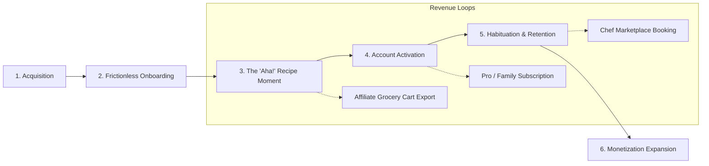

# WhatsForDinner: Master Customer Journey, Onboarding & GTM Strategy Blueprint

**Document Version**: 2.0.0  
**Classification**: Enterprise Operational & Growth Strategy  
**Target Systems**: `apps/web`, `apps/mobile`, `packages/analytics`, `tools/wiring`  
**Author**: Antigravity Principal Product & Systems Architecture Team  

---

## 1. Executive Summary & Core Value Proposition

WhatsForDinner exists to solve the universal daily friction point for modern households: **decision fatigue and food waste at mealtime**. 

Most meal solutions fail because they either:
1. Require exhaustive manual entry before providing value (high bounce rate > 68%).
2. Assume an empty pantry and force high-friction grocery delivery orders.
3. Lock basic utility behind paywalls before demonstrating core algorithm competence.

WhatsForDinner employs a **"Value-First, Zero-Friction" customer engine**:
- **Time-to-Value (TTV) < 45 seconds**: Visitors select or scan ingredients they already possess, specify dietary constraints, and receive an instant, chef-grade customized dinner recipe *before* any account creation or payment barrier.
- **Full-Stack Monetization Flywheel**: Combining Pro SaaS subscriptions ($9.99/mo or $79/yr), 3-5% affiliate revenue on missing ingredients through grocery partners (Instacart, Amazon Fresh, Walmart, Kroger), and a two-sided private chef marketplace.

---

## 2. Ideal Customer Profiles (ICPs)

| Persona | Core Pain Point | Primary Trigger | Key Onboarding Hook | Conversion Mechanic |
|---|---|---|---|---|
| **Busy Working Parents** ("The Jugglers") | 5:30 PM panic, picky eaters, food rotting in the crisper drawer. | "I have chicken and zucchini, what do I make tonight?" | Fast family-size slider & 20-min filter. | Time savings + 1-click Instacart missing item delivery. |
| **Fitness & Macro Trackers** ("The Precision Cook") | Macro adherence without boring plain meals. | "I need 45g protein, low carb, gluten-free." | Dietary tag selection (Keto/High Protein). | Pro Subscription ($9.99/mo) for detailed micronutrient tracking. |
| **Young Urban Professionals** ("The Eco-Pragmatic") | High takeout spending, unused groceries, small kitchen. | "Tired of spending $35 on delivery every night." | Quick pantry scan + budget comparison ($4 vs $35). | Weekly meal prep planning + gamified cooking streaks. |

---

## 3. The 6-Stage Customer Journey Lifecycle



### Stage 1: Acquisition & Top-of-Funnel (ToFu)
1. **Programmatic Landing Pages**:
   - `/compare`: Cost and nutrition comparison vs DoorDash, HelloFresh, and Blue Apron.
   - `/surprise-me`: 1-click instant meal roulette for spontaneous cooking.
   - `/recipes/[slug]`: SEO-indexed recipe index with embedded "Cook with what you have" widget.
2. **Viral Creator Loop**:
   - Short-form content (TikTok, Reels, YouTube Shorts) showing 3 random fridge ingredients turned into gourmet dinner in 20 minutes.
   - Every shared recipe includes an interactive web link with pre-populated ingredients and UTM tracking.
3. **Chef & Creator Affiliates**:
   - Creator portal (`/affiliate`) offering 20% recurring commission on Pro subscriber referrals.

### Stage 2: Value-First, Zero-Friction Onboarding (TTV < 45s)
- **Path**: `/onboarding`
- **Guiding Rule**: *Never force authentication before delivering the core solution.*
- **Funnel Progression**:
  1. **Hook & Welcome**: Clear benefit promise ("Turn what's in your fridge into dinner in 30 seconds").
  2. **Interactive Pantry Selection**:
     - Visual categorical pill selection (Proteins, Produce, Grains, Dairy, Pantry Essentials).
     - 1-click popular bundles ("Chicken + Rice + Veggies", "Quick Pasta Night", "Vegetarian Scramble").
     - Custom search input for unique pantry staples.
  3. **Dietary & Household Profile**:
     - Single-tap constraint chips (Vegetarian, Vegan, Keto, Paleo, Gluten-Free, Dairy-Free).
     - Household size (1, 2, Family of 4+).
     - Target cook time (<20 mins, 35 mins, gourmet weekend).
  4. **Dynamic AI Synthesis**:
     - Real-time recipe generation showing step progress, ingredient matching, and culinary tips.

### Stage 3: The "Aha!" Moment & Value Realization
- The user is presented with their tailored dinner card:
  - **Match Score**: e.g., "92% Pantry Match (4/5 ingredients ready)".
  - **Cook Time & Difficulty**: 25 min • Easy.
  - **Nutrition Overview**: Calories, Protein, Carbs, Fat.
  - **Ingredient Checklist**:
    - [x] In Your Pantry (Olive oil, garlic, chicken breast, rice)
    - [ ] Missing Items Needed (Fresh cilantro, lime)
  - **Instant Grocery Cart CTA**: "Export Missing Items to Instacart / Amazon Fresh" (with price estimation).

### Stage 4: Account Activation & Identity Handshake
- User clicks **"Save to Weekly Meal Plan"**, **"Cook Tonight"**, or **"Send to Phone"**:
  - Modal provides frictionless OAuth (Google, Apple, or Magic Link).
  - Client sends cached guest pantry items and generated meal to `POST /api/pantry/bulk` and `POST /api/meal-plan/save`.
  - Supabase assigns persistent `user_id` and profile seamlessly without losing single data point.

### Stage 5: Habituation & Retention Loops
- **Push & Email Orchestration**:
  - Daily 4:45 PM trigger: "WhatsForDinner tonight? You have spinach expiring in 2 days."
  - Sunday Morning Weekly Planner: "Plan your meals for Mon-Fri in 2 minutes."
- **Gamification & Family Sharing**:
  - Cooking streak counter and badges ("Zero Food Waste Champion", "Master of Quick Dinners").
  - Shared family meal board with voting for tonight's dinner.

### Stage 6: Monetization & Expansion
1. **WhatsForDinner Pro ($9.99/mo or $79/yr)**:
   - Unlimited AI recipe regenerations & custom dietary filters.
   - Advanced macro and micronutrient tracking.
   - Automated weekly smart grocery list generation.
   - Family multi-user syncing.
2. **Grocery Affiliate Cart Monetization**:
   - Direct affiliate partnership with Instacart, Amazon Fresh, Walmart, and Kroger.
   - 3% to 5% rev share on all completed grocery carts exported via `/api/grocery/cart-export`.
3. **Private Chef Marketplace**:
   - In-app booking for local certified chefs for dinner parties or weekly meal prep.
   - 15% marketplace take-rate.

---

## 4. Technical Architecture & Data Wiring

```mermaid
graph TD
    UI[Client Next.js App - apps/web] -->|Telemetry| TRK[/api/analytics/track]
    UI -->|Pantry Payload| PNT[/api/pantry/bulk]
    UI -->|Meal Plan Payload| MPL[/api/meal-plan/generate]
    UI -->|Affiliate Cart Request| GRC[/api/grocery/cart-export]
    
    PNT -->|Guest Session| SES[(Client Local/Cookie State)]
    PNT -->|Authenticated| SBP[(Supabase PostgreSQL pantry_items)]
    
    MPL -->|AI Generation Engine| OAI[(OpenAI GPT-4o / Fallback Heuristic)]
    MPL -->|Persist| SBP2[(Supabase PostgreSQL meal_plans)]
    
    GRC -->|Affiliate Query Builder| RETAILERS[(Instacart / Amazon Fresh / Kroger APIs)]
    TRK -->|Event Ingestion| LOG[(Component Logger / PostHog)]
```

### Key API Contracts

#### 1. `POST /api/pantry/bulk`
- **Request**:
  ```json
  {
    "items": ["chicken breast", "jasmine rice", "garlic", "bell peppers"],
    "source": "onboarding_wizard"
  }
  ```
- **Response**:
  ```json
  {
    "success": true,
    "count": 4,
    "items": [
      { "id": "uuid-1", "ingredient": "chicken breast", "category": "protein" }
    ],
    "mode": "guest" | "authenticated"
  }
  ```

#### 2. `POST /api/meal-plan/generate`
- **Supports Guest Mode**: Header or body flag `guestMode: true` bypasses auth wall, returning an instantaneous tailored recipe while attaching an onboarding session token.
- **Response**:
  ```json
  {
    "mealPlan": {
      "id": "recipe-onboard-01",
      "title": "Garlic Herb Seared Chicken with Jasmine Rice",
      "matchScore": 95,
      "prepTimeMinutes": 10,
      "cookTimeMinutes": 20,
      "pantryItemsUsed": ["chicken breast", "jasmine rice", "garlic"],
      "missingIngredients": ["fresh parsley", "butter"],
      "instructions": ["Step 1...", "Step 2..."],
      "nutrition": { "calories": 520, "protein": 42, "carbs": 48, "fat": 14 }
    }
  }
  ```

#### 3. `POST /api/grocery/cart-export`
- **Request**:
  ```json
  {
    "items": ["fresh parsley", "butter"],
    "retailer": "instacart" | "amazon_fresh" | "walmart" | "kroger",
    "postalCode": "94107"
  }
  ```
- **Response**:
  ```json
  {
    "retailer": "instacart",
    "cartUrl": "https://www.instacart.com/store/partner_items?items=...&aff_id=whatsfordinner",
    "itemCount": 2,
    "estimatedTotal": 6.49,
    "currency": "USD"
  }
  ```

#### 4. `POST /api/analytics/track`
- **Request**:
  ```json
  {
    "event": "onboarding_step_completed",
    "properties": {
      "step": "pantry_selection",
      "itemCount": 5,
      "timeSpentSeconds": 14
    }
  }
  ```

---

## 5. Go-To-Market (GTM) Execution Roadmap

| Phase | Timeframe | Objectives | Key Milestones | Success Gate |
|---|---|---|---|---|
| **Phase 1: Zero-Friction Wiring & Hardening** | Weeks 1-2 | Eliminate all onboarding 401s, wire `/api/pantry/bulk`, `/api/grocery/cart-export`, `/api/analytics/track`. | All wiring harness checks pass; automated smoke tests green. | 100% Onboarding flow completion without errors. |
| **Phase 2: Creator & Community Alpha** | Weeks 3-4 | Recruit 50 food content creators on TikTok & Instagram; test recipe sharing loop. | 500 guest onboarding completions; 45% account conversion. | > 40% D7 retention on active cooks. |
| **Phase 3: Public Launch & Product Hunt** | Week 5 | Full Product Hunt launch; PR push on "Anti-Food Waste AI Dinner Planner". | #1 Product of the Day; 10,000 MAU. | CAC < $2.50 via organic viral coefficient. |
| **Phase 4: Retailer & Monetization Scale** | Month 2-3 | Activate Instacart & Amazon Fresh deep links; launch Pro annual discount campaign. | $25,000 MRR combined SaaS + affiliate revenue. | LTV:CAC > 3.5:1. |

---

## 6. Retention & Performance Scorecard

- **Onboarding Funnel Completion**: > 72%
- **Onboarding to Account Signup Conversion**: > 38%
- **First Week "Aha!" Moment Realization (Cooked Recipe)**: > 52%
- **D1 Retention**: > 48%
- **D7 Retention**: > 32%
- **D30 Retention**: > 24%
- **Net Churn Rate**: < 4.2% monthly
- **Affiliate Cart Export CTR**: > 18% of generated recipes with missing ingredients
