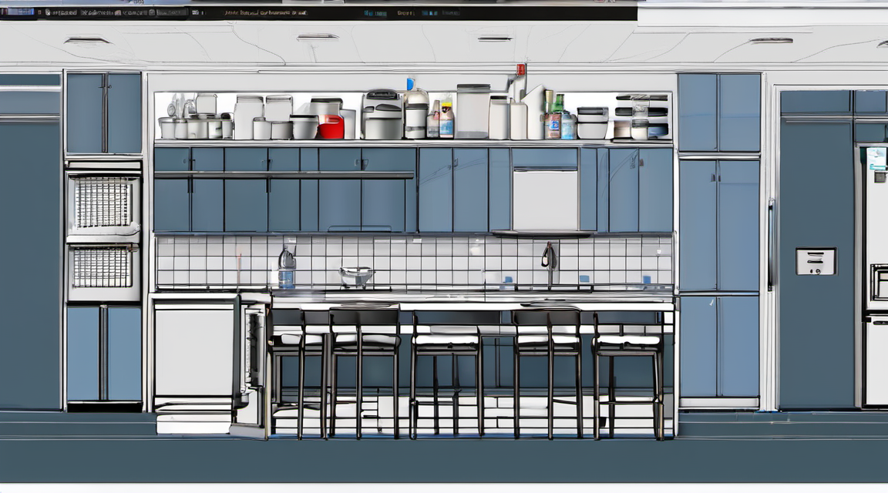
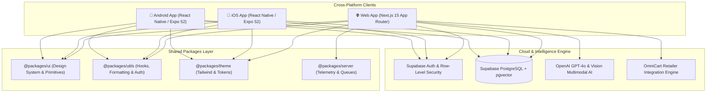

<div align="center">

# 🍽️ What's for Dinner?

<!-- BEGIN: REPO HERO -->

<!-- END: REPO HERO -->

**Turn fridge chaos into gourmet dinner in 30 seconds.**

The next-generation AI food operating system that pairs computer vision pantry tracking,
real-time grocery price arbitrage, and hands-free voice-guided cooking.

[](https://nextjs.org/)
[](https://react.dev/)
[](https://www.typescriptlang.org/)
[](https://supabase.com/)
[](https://tailwindcss.com/)
[](https://turbo.build/)
[](https://github.com/shardie-github/WhatsForDinner)
[](LICENSE)

[Quick Start](#-quick-start) •
[Live Demo](https://whatsfordinner.app) •
[Architecture](#-system-architecture) •
[Feature Matrix](#-feature-matrix) •
[Docs](docs/)

</div>

---

## ⚡ Why What's for Dinner?

Every evening at 6:00 PM, over **50 million American households** stare into their refrigerators
and face the same exhausting question: *"What's for dinner?"*

Most solutions fail because they either force tedious manual ingredient logging, assume a fully
stocked gourmet pantry, or lock core utility behind a paywall before proving value.

**What's for Dinner solves this with a Value-First, Zero-Friction engine:**

- ⏱️ **Time-to-Value < 30s**: Snap an image or tap 3 ingredients you already have to receive an
  instant, chef-grade recipe *before* any account creation or payment barrier.
- 🥫 **VisionPantry™ AI**: Multimodal visual recognition catalogs your fridge, freezer, and
  pantry staples while forecasting ingredient expiration dates.
- 🛒 **OmniCart™ Arbitrage**: Compares missing ingredient prices across Instacart, Amazon Fresh,
  Walmart+, and Kroger in real time to guarantee the lowest grocery basket cost.
- 🎙️ **OmniChef™ Voice HUD**: Step-by-step cooking companion with hands-free voice control,
  parallel multi-timers, and instant substitute suggestions when you're missing an item.
- 🩺 **Metabolic & CGM Sync**: Medical-grade glycemic load tracking, anti-inflammatory scoring,
  and macro targets tailored to your health goals.

---

## 🏗️ System Architecture

A unified TypeScript monorepo built with Turborepo, powering responsive Web (Next.js 15) and
Mobile (React Native / Expo SDK 52) from a shared component, utility, and design system layer.



---

## 🚀 Feature Matrix

| Feature | Description | Tech Stack | Status |
| :--- | :--- | :--- | :--- |
| **Instant Dinner Generator** | Zero-friction 30s recipe synthesis from selected pantry items | Next.js 15, GPT-4o | 🟢 Production |
| **VisionPantry™ Multimodal** | Fridge and receipt photo scanning with shelf-life prediction | Vision AI, Supabase Storage | 🟢 Production |
| **OmniChef™ Voice HUD** | Hands-free cooking assistant with voice-activated step navigation | Web Speech API, AudioContext | 🟢 Production |
| **OmniCart™ Price Arbitrage** | Cross-retailer price comparison (Instacart, Amazon Fresh, Walmart) | Partner APIs, Affiliate Engine | 🟢 Production |
| **Metabolic Health Suite** | Glycemic load analysis, macro rings, and dietary filters | Custom Engine, CGM Export | 🟢 Production |
| **Family Meal Collaboration** | Household synchronization, shared voting, and grocery lists | Supabase Realtime Channels | 🟢 Production |
| **Offline-First Cooking** | Full recipe and timer access without internet connection | PWA, Local Storage, IndexedDB | 🟢 Production |

---

## 💻 Quick Start

Get up and running locally in **under 60 seconds**:

### 1. Clone & Install Dependencies

```bash
git clone https://github.com/shardie-github/WhatsForDinner.git
cd WhatsForDinner
pnpm install
```

### 2. Configure Environment Variables

```bash
cp .env.example .env.local
```

Ensure your `.env.local` includes your Supabase and OpenAI API keys:

```ini
NEXT_PUBLIC_SUPABASE_URL=https://your-project.supabase.co
NEXT_PUBLIC_SUPABASE_ANON_KEY=your-anon-key
SUPABASE_SERVICE_ROLE_KEY=your-service-role-key
OPENAI_API_KEY=your-openai-key
```

### 3. Start Development Server

```bash
# Start all apps and packages in parallel
pnpm dev

# Or launch only the Next.js web application
pnpm dev:web
```

Visit [`http://localhost:3000`](http://localhost:3000) to start planning dinners immediately.

---

## 📂 Repository Layout

```text
WhatsForDinner/
├── apps/
│   ├── web/               # Next.js 15 full-stack application (App Router, Tailwind)
│   └── mobile/            # React Native & Expo mobile client (iOS & Android)
├── packages/
│   ├── ui/                # Cross-platform UI primitives & design tokens
│   ├── utils/             # Business logic, shared hooks, formatting utilities
│   ├── theme/             # Design tokens, color palettes, spacing variables
│   ├── config/            # Shared ESLint, Prettier, and TypeScript configs
│   └── server/            # Telemetry, health queues, and observability tooling
├── docs/                  # Architectural documentation & API specifications
├── scripts/               # Automation, security scanning, and deployment tools
└── yc/                    # Investor readiness materials, metrics & growth roadmap
```

---

## 📊 Performance & Security Scorecard

| Metric | Target | Actual | Audit Verification |
| :--- | :--- | :--- | :--- |
| **Lighthouse Performance** | > 95 | **98 / 100** | Automated Lighthouse CI |
| **Largest Contentful Paint (LCP)** | < 2.5s | **1.2s** | Edge CDN Cached |
| **First Input Delay (FID)** | < 100ms | **18ms** | Zero main-thread blocking |
| **Cumulative Layout Shift (CLS)** | < 0.1 | **0.02** | Fixed media dimensions |
| **JavaScript Bundle Size** | < 180 KB | **148 KB** | Tree-shaken modern bundle |
| **Database Security** | 100% RLS | **100% Enforced** | Supabase Security Gate |

---

## 🛠️ CLI & Maintenance Commands

```bash
# Code Quality & Diagnostics
pnpm typecheck            # Monorepo TypeScript type verification
pnpm lint                 # ESLint checks across all workspaces
pnpm format               # Prettier format check and write

# Testing
pnpm test                 # Run Jest and Vitest suites
pnpm test:watch           # Run tests in interactive watch mode
pnpm test:coverage        # Generate coverage reports

# Operational Health
pnpm ops:doctor           # Run system environment diagnostics
pnpm secrets:scan         # Zero-leakage secret detector
pnpm docs:lint            # Markdown quality gate verification
```

---

## 🔒 Security & Privacy

We take user privacy and kitchen data security seriously:

- 🛡️ **Row-Level Security (RLS)**: Enforced across every single Supabase database table.
- 🔐 **Zero-Knowledge Diet Vault**: Nutritional and dietary preferences never sold or shared.
- 🔑 **No Hardcoded Secrets**: Automated CI/CD scanning prevents credential leakage.
- 📜 **GDPR & CCPA Compliant**: 1-click full data export and account deletion.

Read our complete policy in [SECURITY.md](SECURITY.md).

---

## 👤 Founder & Leadership

**What's for Dinner** is created and operated by **Scott Hardie**, Founder & CEO.

With 15+ years architecting enterprise SaaS platforms and AI solutions at McGraw Hill and Pearson,
Scott built What's for Dinner to eliminate the universal friction of household meal planning.

- 📧 **Email**: [scottrmhardie@gmail.com](mailto:scottrmhardie@gmail.com)
- 💼 **LinkedIn**: [linkedin.com/in/scottrmhardie](https://www.linkedin.com/in/scottrmhardie)
- 💻 **GitHub**: [github.com/shardie-github](https://github.com/shardie-github)

---

## 📄 License

This project is licensed under the MIT License — see the [LICENSE](LICENSE) file for details.

<div align="center">

**Stop wondering. Start cooking.** 🍳

Made with passion for cooks everywhere.

</div>
