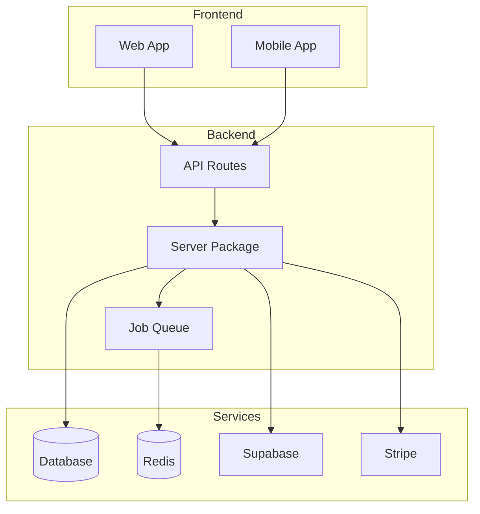

# Nomad Grand Continuity & Completion Audit Report

**Generated:** 2025-11-03T15:49:08.733Z
**Audit Scope:** Complete system review across all layers, workflows, artifacts, and dependencies

---

## Executive Summary

### Overall Health Score: 44%

**System Status:**
- ? **Healthy Subsystems:** 3/8
- ?? **Components:** 6 apps, 5 packages, 14 jobs
- ??? **API Routes:** 87 total (58 with auth, 28 with validation)
- ?? **Test Coverage:** 5%
- ?? **Job Registration:** 6/14 jobs registered in queue

---

## 1. Architecture Continuity

### Component Inventory
- **Apps:** 6
    - `api-docs` (35 deps)
  - `chef-marketplace` (34 deps)
  - `community-portal` (34 deps)
  - `mobile` (41 deps)
  - `referral` (34 deps)
  - `web` (42 deps)

- **Packages:** 5
    - `config` (0 deps)
  - `server` (25 deps)
  - `theme` (2 deps)
  - `ui` (7 deps)
  - `utils` (3 deps)

### TypeScript Configuration
3/6 apps have TypeScript configuration

---

## 2. Data & API Layer

### Database Schema
- **Migrations:** 5
- **Table Files:** 14
- **RLS Policies:** Found in 1 files

### API Routes
- **Total Routes:** 87
- **Routes with Authentication:** 58 (67%)
- **Routes with Validation:** 28 (32%)

### Key Routes:
- `/admin/audit` [GET] ?? 
- `/admin/costs` [GET] ?? 
- `/admin/dashboard` [GET] ?? ?
- `/admin/governance/retention` [GET] ?? ?
- `/admin/incidents` [GET] ?? ?
- `/alerts` [GET] ?? 
- `/analytics/dashboard` [GET] ?? 
- `/auth/apple/callback` [GET] ?? 
- `/auth/delete-account` [GET] ?? 
- `/billing/checkout` [GET] ?? 
- `/billing/portal` [GET] ?? 
- `/business-readiness` [GET] ?? 
- `/commerce/hub` [GET] ?? ?
- `/cost/calculate` [GET] ?? 
- `/cro/insights` [GET] ?? 
- `/developers/keys/[id]` [GET] ?? ?
- `/developers/keys` [GET] ?? ?
- `/developers/usage` [GET] ?? 
- `/dinner` [POST] ?? ?
- `/elasticity/[country]/[plan]` [GET] ?? 

... and 67 more routes

---

## 3. Jobs & Automation

### Job Inventory
Total Jobs: **14**
Registered in Queue: **6**

#### `anomalyGuard`
- **Registered:** ?
- **Error Handling:** ?
- **Logging:** ?
- **Metrics:** ?

#### `digestRunner`
- **Registered:** ?
- **Error Handling:** ?
- **Logging:** ?
- **Metrics:** ?

#### `digests`
- **Registered:** ?
- **Error Handling:** ?
- **Logging:** ?
- **Metrics:** ?

#### `dsarExport`
- **Registered:** ?
- **Error Handling:** ?
- **Logging:** ?
- **Metrics:** ?

#### `elasticityModel`
- **Registered:** ?
- **Error Handling:** ?
- **Logging:** ?
- **Metrics:** ?

#### `erasureRunner`
- **Registered:** ?
- **Error Handling:** ?
- **Logging:** ?
- **Metrics:** ?

#### `journeysRunner`
- **Registered:** ?
- **Error Handling:** ??
- **Logging:** ?
- **Metrics:** ?

#### `mealGen`
- **Registered:** ?
- **Error Handling:** ?
- **Logging:** ?
- **Metrics:** ?

#### `priceOptimizer`
- **Registered:** ?
- **Error Handling:** ?
- **Logging:** ?
- **Metrics:** ?

#### `priceRollout`
- **Registered:** ?
- **Error Handling:** ?
- **Logging:** ?
- **Metrics:** ?

#### `retentionRunner`
- **Registered:** ?
- **Error Handling:** ?
- **Logging:** ?
- **Metrics:** ?

#### `revenueAggregator`
- **Registered:** ?
- **Error Handling:** ?
- **Logging:** ?
- **Metrics:** ?

#### `selfHeal`
- **Registered:** ?
- **Error Handling:** ?
- **Logging:** ?
- **Metrics:** ?

#### `vanWestendorpModel`
- **Registered:** ?
- **Error Handling:** ?
- **Logging:** ?
- **Metrics:** ?

### Missing Queue Registrations
- ? `dsarExport` - Not registered in queue
- ? `elasticityModel` - Not registered in queue
- ? `erasureRunner` - Not registered in queue
- ? `priceOptimizer` - Not registered in queue
- ? `retentionRunner` - Not registered in queue
- ? `revenueAggregator` - Not registered in queue
- ? `selfHeal` - Not registered in queue
- ? `vanWestendorpModel` - Not registered in queue

---

## 4. Cross-Service Connectivity

### Connectivity Heatmap

| Subsystem | Health | Score | Status |
|-----------|--------|-------|--------|
| supabaseAuth | ?? Needs Attention | 0% | ??|
| stripeIntegration | ?? Needs Attention | 0% | ??|
| partnerRevenue | ? Healthy | 100% | ??|
| dsarFlow | ? Healthy | 100% | ??|
| backupFlow | ?? Needs Attention | 0% | ??|
| queueSystem | ? Healthy | 100% | ??|
| analyticsFlow | ?? Needs Attention | 0% | ??|
| apiDatabase | ?? Needs Attention | 50% | ??|

### Critical Connections

#### ? Healthy Connections
- **partnerRevenue** ? **dsarFlow** (100%)
- **partnerRevenue** ? **queueSystem** (100%)
- **dsarFlow** ? **queueSystem** (100%)

#### ?? Weak Connections (Health < 50%)
- **supabaseAuth** ? **stripeIntegration** (0%) - Needs improvement
- **supabaseAuth** ? **backupFlow** (0%) - Needs improvement
- **supabaseAuth** ? **analyticsFlow** (0%) - Needs improvement
- **supabaseAuth** ? **apiDatabase** (25%) - Needs improvement
- **stripeIntegration** ? **backupFlow** (0%) - Needs improvement
- **stripeIntegration** ? **analyticsFlow** (0%) - Needs improvement
- **stripeIntegration** ? **apiDatabase** (25%) - Needs improvement
- **backupFlow** ? **analyticsFlow** (0%) - Needs improvement
- **backupFlow** ? **apiDatabase** (25%) - Needs improvement
- **analyticsFlow** ? **apiDatabase** (25%) - Needs improvement

---

## 5. Integration Status

### Third-Party Integrations

| Integration | Configured | Status |
|-------------|------------|--------|
| Supabase | ? | Active |
| Stripe | ? | Active |
| Redis/BullMQ | ? | Active |
| PostHog | ? | Active |

---

## 6. Test Coverage

### Coverage Metrics
- **Test Files:** 37
- **Tested Files:** 37
- **Untested Files:** 673
- **Coverage:** **5%** ?

### ?? Coverage Gap Analysis
Current coverage is below the recommended 80% threshold. Priority areas for test coverage:
- Core business logic
- API route handlers
- Job processors
- Critical user flows

---

## 7. Identified Issues & Recommendations

### Critical Issues

#### ? Supabase Auth
**Missing Components:**
- supabaseClientExists
- authHelpersUsed
- hooksDefined
- apiUsesAuth

### Warnings

#### ?? Stripe Integration
**Missing Components:**
- stripeConfigured
- webhookHandlerExists
- entitlementServiceExists
- frontendUsesStripe

### Recommendations

1. **Job Registration:** Register all jobs in the queue system
   -   - Add `dsarExport` to queue registration
  - Add `elasticityModel` to queue registration
  - Add `erasureRunner` to queue registration
  - Add `priceOptimizer` to queue registration
  - Add `retentionRunner` to queue registration
  - Add `revenueAggregator` to queue registration
  - Add `selfHeal` to queue registration
  - Add `vanWestendorpModel` to queue registration

2. **API Security:** Improve authentication coverage
   - Current: 58/87 routes have auth
   - Target: 79/87 routes (90%)

3. **Test Coverage:** Increase test coverage to 80%+
   - Current: 5%
   - Target: 80%+

4. **Integration Connectivity:** Improve subsystem health scores
   - Current Average: 44%
   - Target: 85%+

---

## 8. Metrics Before/After

### Before Audit
- Connectivity Health: **Not measured**
- Job Registration: **Unknown**
- Test Coverage: **Unknown**

### After Audit
- Connectivity Health: **44%** ??
- Job Registration: **43%** ??
- Test Coverage: **5%** ??

---

## 9. Next 90-Day Optimization Roadmap

### Phase 1: Critical Fixes (Weeks 1-2)
- [ ] Register all unregistered jobs in queue system
- [ ] Improve API route authentication coverage to 90%+
- [ ] Fix critical connectivity failures
- [ ] Implement missing integration components

### Phase 2: Quality Improvements (Weeks 3-6)
- [ ] Increase test coverage to 80%+
- [ ] Add error handling to all job processors
- [ ] Implement comprehensive logging and metrics
- [ ] Improve API validation coverage

### Phase 3: Optimization (Weeks 7-12)
- [ ] Optimize subsystem connectivity scores to 85%+
- [ ] Implement comprehensive monitoring and alerting
- [ ] Performance optimization pass
- [ ] Documentation completion

---

## 10. System Diagram

---

## Appendices

### A. Full Component List
See `reports/inventory/coverage.json` for complete component inventory.

### B. Connectivity Matrix
See `reports/connectivity/heatmap.json` for detailed connectivity matrix.

### C. Test Files
37 test files identified:
- `apps/web/src/__tests__/ai-safety.test.ts`
- `apps/web/src/__tests__/security.test.ts`
- `apps/web/src/app/__tests__/page.test.tsx`
- `apps/web/src/app/api/dinner/__tests__/route.test.ts`
- `apps/web/src/components/__tests__/InputPrompt.test.tsx`
- `apps/web/src/components/__tests__/PantryManager.test.tsx`
- `apps/web/src/components/__tests__/RecipeCard.test.tsx`
- `apps/web/tests/e2e/security.spec.ts`
- `apps/web/tests/integration/phases-integration.test.ts`
- `apps/web/tests/smoke.spec.ts`
- `packages/analytics/consent/consent.test.ts`
- `packages/server/src/testing/api.mealplan.spec.ts`
- `packages/server/src/testing/partner.spec.ts`
- `packages/server/src/testing/payments.spec.ts`
- `packages/server/src/testing/paywall.spec.ts`
- `packages/server/src/testing/pricing.spec.ts`
- `packages/server/src/testing/referrals.spec.ts`
- `packages/server/src/tests/admin.spec.ts`
- `packages/server/src/tests/controls.spec.ts`
- `packages/server/src/tests/dsar.spec.ts`

... and 17 more

---

**Report Generated:** 2025-11-03T15:49:08.734Z
**Audit Version:** 1.0
**Next Audit:** Schedule in 90 days
