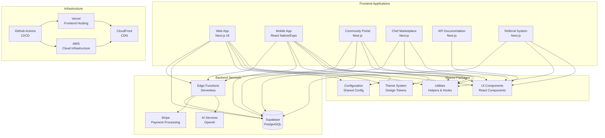

# Architecture Map

This document provides a visual representation of the system architecture for "What's for Dinner".

## System Overview



## Components

### Frontend Applications

#### Web App (`apps/web`)
- **Technology**: Next.js 16, React 19, TypeScript
- **Purpose**: Primary web application with PWA support
- **Features**: 
  - Meal planning and recipe generation
  - Pantry management
  - User dashboard
  - Offline support via PWA

#### Mobile App (`apps/mobile`)
- **Technology**: React Native, Expo SDK 51
- **Purpose**: Native mobile applications for iOS and Android
- **Features**:
  - Cross-platform mobile experience
  - Native navigation
  - Mobile-optimized UI

#### Community Portal (`apps/community-portal`)
- **Technology**: Next.js 16
- **Purpose**: Community-driven content platform
- **Features**:
  - User-generated recipes
  - Social interactions
  - Gamification

#### Chef Marketplace (`apps/chef-marketplace`)
- **Technology**: Next.js 16
- **Purpose**: Partner and chef onboarding platform
- **Features**:
  - Chef profiles
  - Recipe packs
  - Revenue tracking

#### API Documentation (`apps/api-docs`)
- **Technology**: Next.js 16
- **Purpose**: Developer documentation portal
- **Features**:
  - API reference
  - SDK downloads
  - Developer onboarding

#### Referral System (`apps/referral`)
- **Technology**: Next.js 16
- **Purpose**: Referral and viral growth features
- **Features**:
  - Referral codes
  - Social sharing
  - Campaign management

### Shared Packages

#### UI Components (`packages/ui`)
- **Purpose**: Shared React components across all applications
- **Features**:
  - Cross-platform compatible components
  - Design system integration
  - Accessible by default

#### Utilities (`packages/utils`)
- **Purpose**: Shared utilities and hooks
- **Features**:
  - Validation schemas
  - Device detection
  - Responsive utilities
  - Type-safe helpers

#### Theme System (`packages/theme`)
- **Purpose**: Centralized design tokens
- **Features**:
  - Color palettes
  - Typography scales
  - Spacing system
  - Breakpoints

#### Configuration (`packages/config`)
- **Purpose**: Shared configuration
- **Features**:
  - Environment variables
  - Feature flags
  - App settings

### Backend Services

#### Supabase
- **Database**: PostgreSQL with Row Level Security (RLS)
- **Auth**: Built-in authentication system
- **Storage**: File storage for images and assets
- **Realtime**: WebSocket connections for real-time updates
- **Edge Functions**: Serverless functions for backend logic

#### AI Services
- **Provider**: OpenAI
- **Models**: GPT-4o, GPT-4o-mini
- **Usage**: Recipe generation, content enhancement
- **Optimization**: Token usage tracking, cost optimization

#### Stripe
- **Purpose**: Payment processing and billing
- **Features**: 
  - Subscription management
  - Checkout sessions
  - Webhook handling
  - Revenue tracking

### Infrastructure

#### Vercel
- **Purpose**: Frontend hosting and deployment
- **Features**: 
  - Automatic deployments
  - Edge network
  - Analytics
  - Preview deployments

#### AWS
- **Purpose**: Cloud infrastructure
- **Services**: 
  - Lambda (serverless functions)
  - S3 (storage)
  - CloudFront (CDN)
  - Route 53 (DNS)

#### GitHub Actions
- **Purpose**: CI/CD pipeline
- **Features**:
  - Automated testing
  - Build automation
  - Deployment workflows
  - Security scanning

## Data Flow

The application follows a monorepo architecture with the following data flow:

1. **User Interaction**: Users interact with frontend applications (Web, Mobile, Community Portal, etc.)

2. **Component Layer**: UI components from shared packages render the interface

3. **State Management**: React Query manages server state, local state uses React hooks

4. **API Layer**: Next.js API routes handle backend logic and data processing

5. **Authentication**: Supabase Auth handles user authentication and authorization

6. **Database Operations**: 
   - Direct database queries via Supabase client
   - Row Level Security (RLS) policies enforce data access
   - Edge functions for complex operations

7. **External Services**:
   - AI services (OpenAI) for recipe generation
   - Payment processing (Stripe) for billing
   - CDN (CloudFront) for asset delivery

8. **Real-time Updates**: Supabase Realtime provides live data synchronization

9. **Analytics & Monitoring**: Built-in observability system tracks performance and errors

## Technology Stack

### Frontend
- **Framework**: Next.js 16 (App Router)
- **Language**: TypeScript 5
- **UI Library**: React 19
- **Styling**: Tailwind CSS, NativeWind
- **State Management**: React Query, Zustand
- **Mobile**: React Native 0.75, Expo SDK 51

### Backend
- **Database**: PostgreSQL (via Supabase)
- **Auth**: Supabase Auth
- **API**: Next.js API Routes, Supabase Edge Functions
- **Serverless**: AWS Lambda (optional)

### Infrastructure
- **Hosting**: Vercel (frontend), Supabase (backend)
- **CDN**: CloudFront, Vercel Edge
- **CI/CD**: GitHub Actions
- **Monitoring**: Built-in observability system

### Development Tools
- **Monorepo**: Turborepo
- **Package Manager**: pnpm 9.0.0
- **Testing**: Jest, Playwright, React Testing Library
- **Linting**: ESLint, Prettier
- **Type Checking**: TypeScript

## Deployment Architecture

### Development Environment
```
Developer Machine → Local Development → pnpm dev
```

### Staging Environment
```
GitHub → GitHub Actions → Build & Test → Deploy to Vercel (Staging)
```

### Production Environment
```
GitHub (main) → GitHub Actions → Build & Test → Deploy to Vercel (Production) → CloudFront CDN
```

## Security Architecture

1. **Authentication**: Supabase Auth with JWT tokens
2. **Authorization**: Row Level Security (RLS) policies in PostgreSQL
3. **API Security**: Rate limiting, request validation
4. **Data Protection**: Encryption at rest and in transit
5. **CORS**: Configured for allowed origins
6. **Secrets Management**: Environment variables, encrypted storage

## Performance Architecture

1. **Caching**: 
   - Edge caching via CDN
   - React Query for API response caching
   - Service Worker for offline caching (PWA)

2. **Optimization**:
   - Code splitting via Next.js
   - Image optimization
   - Bundle size optimization
   - Lazy loading

3. **Monitoring**:
   - Real-time performance metrics
   - Error tracking
   - User analytics
   - Performance budgets

## Scalability

The architecture is designed to scale horizontally:

1. **Stateless Applications**: All apps are stateless, allowing horizontal scaling
2. **Database**: PostgreSQL with connection pooling
3. **CDN**: Distributed content delivery
4. **Serverless**: Edge functions scale automatically
5. **Multi-tenant**: Built-in tenant isolation

## High Availability

1. **Redundancy**: Multiple deployment regions
2. **Monitoring**: Real-time health checks and alerting
3. **Backup**: Automated database backups
4. **Disaster Recovery**: Documented recovery procedures
5. **Failover**: Automatic failover mechanisms
