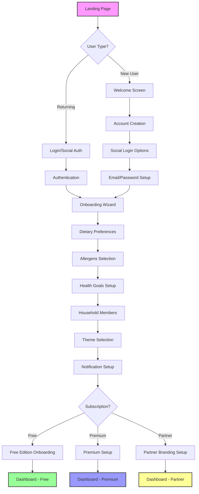
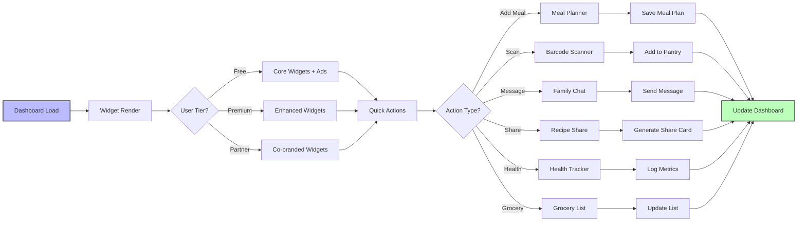
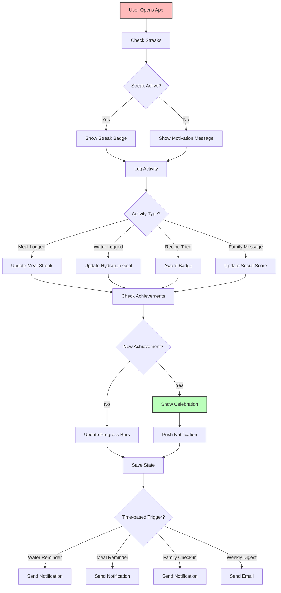
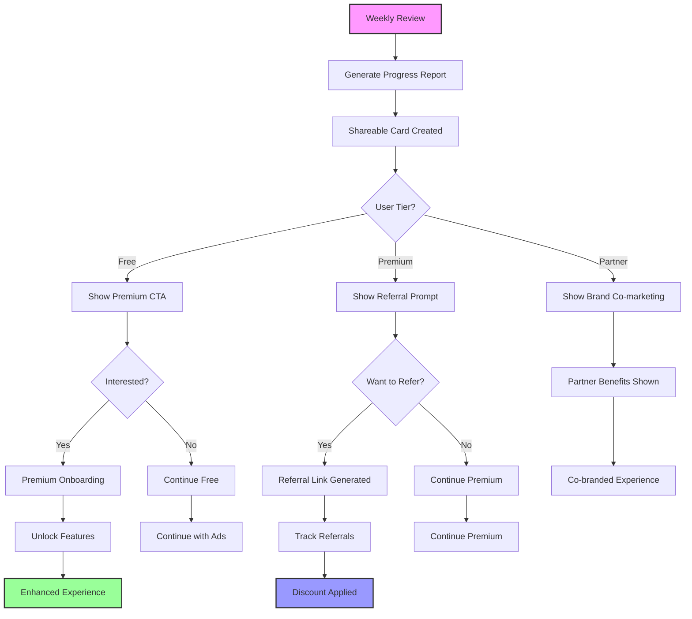
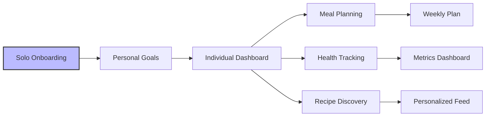
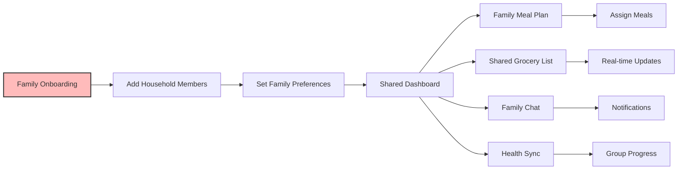
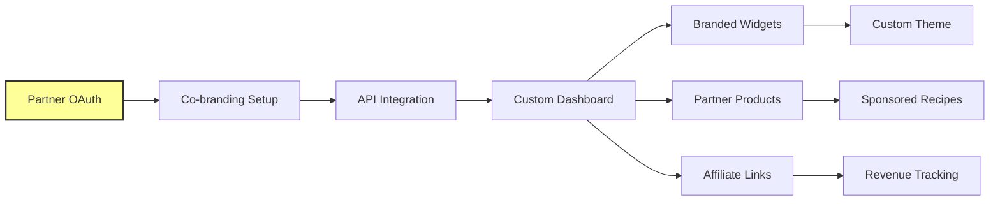

# Nomad UX Journey Maps

## Overview
This document outlines the complete user experience journey for Nomad across three user roles and three product tiers.

---

## 1. Onboarding ? Personalization Journey

### Emotional Touchpoints

| Stage | Emotion | Functional Goal | UI Element |
|-------|---------|----------------|------------|
| Landing | Curiosity | Capture interest | Hero video, value prop |
| Welcome | Warmth | Build trust | Personalized greeting |
| Preferences | Empowerment | Enable customization | Interactive selectors |
| Goals | Motivation | Set clear objectives | Progress visualization |
| Dashboard | Achievement | Show immediate value | Success animation |

---

## 2. Daily Dashboard Flow

### Dashboard Widget Priority

1. **Meal Plan Card** - Today's meals with quick edit
2. **Health Metrics** - Calories, water, steps (if wearables connected)
3. **Grocery List** - Auto-populated from meal plan
4. **Recipe Spotlight** - AI-recommended recipe
5. **Family Feed** - Recent family activity
6. **Streaks & Badges** - Gamification widget
7. **Ad Placement** (Free) - Contextual ad every 5th widget

---

## 3. Engagement Loop

---

## 4. Retention & Growth Flow

---

## 5. Role-Based Views

### Solo User Journey

**Key Features:**
- Personalized meal recommendations
- Individual health goals
- Private recipe collection
- Solo streak tracking

---

### Family Planner Journey

**Key Features:**
- Multi-user meal planning
- Shared grocery lists
- Family chat & notifications
- Coordinated health goals
- Family streak challenges

---

### Partner Brand Journey

**Key Features:**
- Custom branding & themes
- API data partnerships
- Co-marketing opportunities
- Affiliate revenue sharing
- White-label options

---

## 6. Key Emotional Moments

### ?? High-Impact Touchpoints

1. **First Successful Meal Plan**
   - Emotion: Achievement
   - Visual: Confetti animation
   - Action: Badge unlock

2. **Streak Milestone (7, 30, 100 days)**
   - Emotion: Pride
   - Visual: Fire animation
   - Action: Share prompt

3. **Family Member Joins**
   - Emotion: Connection
   - Visual: Heart animation
   - Action: Welcome message

4. **Recipe Success Story**
   - Emotion: Satisfaction
   - Visual: Star rating animation
   - Action: Save to favorites

5. **Premium Upgrade**
   - Emotion: Excitement
   - Visual: Feature unlock animation
   - Action: Tour of new features

---

## 7. Notification Strategy

### Push Notification Timing

| Trigger | Timing | Message Type | Tier |
|---------|--------|-------------|------|
| Water Reminder | Every 2 hours (9am-9pm) | Hydration | All |
| Meal Reminder | 30min before scheduled meal | Meal Planning | All |
| Streak Warning | 6pm if no activity | Engagement | All |
| Family Message | Real-time | Communication | All |
| Weekly Digest | Sunday 9am | Progress Report | All |
| Premium Trial | After 7 days active | Conversion | Free |
| Partner Deal | Contextual | Marketing | Partner |

---

## 8. Accessibility Considerations

- **Screen Reader Support**: All interactive elements labeled
- **Keyboard Navigation**: Full keyboard support for all flows
- **Color Contrast**: WCAG AAA compliant
- **Font Scaling**: Supports up to 200% text scaling
- **Motion Reduction**: Respects `prefers-reduced-motion`
- **Voice Input**: Available for all text inputs
- **High Contrast Mode**: Dedicated theme option

---

## Next Steps

1. Implement journey map components
2. Build onboarding wizard
3. Create dashboard widget system
4. Design gamification system
5. Implement notification service
