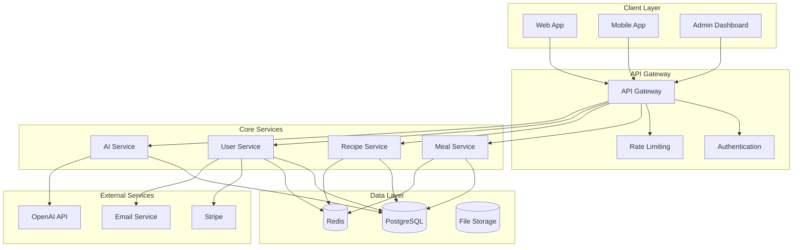
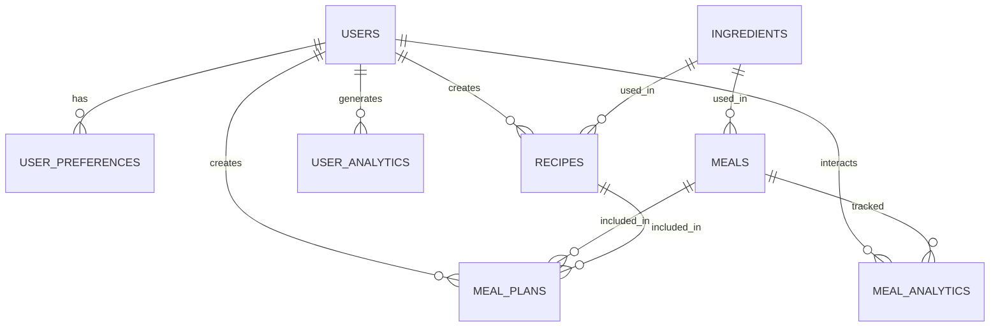
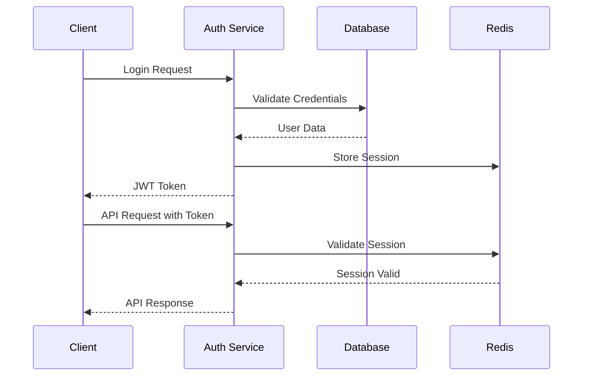

# Architecture Documentation

This document provides a comprehensive overview of the What's for Dinner application architecture.

## Table of Contents

- [Overview](#overview)
- [System Architecture](#system-architecture)
- [Technology Stack](#technology-stack)
- [Database Design](#database-design)
- [API Design](#api-design)
- [Frontend Architecture](#frontend-architecture)
- [Mobile Architecture](#mobile-architecture)
- [Deployment Architecture](#deployment-architecture)
- [Security Architecture](#security-architecture)
- [Performance Architecture](#performance-architecture)
- [Monitoring Architecture](#monitoring-architecture)

## Overview

What's for Dinner is a modern, scalable SaaS application that provides AI-powered meal generation and planning services. The application is built using a microservices architecture with a focus on performance, scalability, and maintainability.

### Key Principles

- **Microservices**: Modular, independently deployable services
- **API-First**: RESTful APIs with comprehensive documentation
- **Cloud-Native**: Designed for cloud deployment and scaling
- **Security-First**: Comprehensive security measures throughout
- **Performance-Optimized**: Fast response times and efficient resource usage
- **Developer-Friendly**: Easy to develop, test, and maintain

## System Architecture

### High-Level Architecture



### Service Architecture

#### Web Application
- **Framework**: Next.js 14 with App Router
- **Language**: TypeScript
- **Styling**: Tailwind CSS
- **State Management**: Zustand
- **Authentication**: NextAuth.js with JWT

#### Mobile Application
- **Framework**: React Native with Expo
- **Language**: TypeScript
- **Navigation**: React Navigation
- **State Management**: Redux Toolkit
- **Offline Support**: Redux Persist

#### API Services
- **Framework**: Node.js with Express
- **Language**: TypeScript
- **Database**: PostgreSQL with Supabase
- **Caching**: Redis
- **Authentication**: JWT with refresh tokens

#### AI Service
- **Provider**: OpenAI GPT-4
- **Integration**: Custom prompt engineering
- **Caching**: Redis for response caching
- **Rate Limiting**: Built-in OpenAI rate limits

## Technology Stack

### Frontend Technologies

| Technology | Version | Purpose |
|------------|---------|---------|
| Next.js | 14.0.0 | Web framework |
| React | 18.2.0 | UI library |
| TypeScript | 5.0.0 | Type safety |
| Tailwind CSS | 3.3.0 | Styling |
| Zustand | 4.4.0 | State management |
| React Query | 4.0.0 | Data fetching |
| Framer Motion | 10.0.0 | Animations |

### Backend Technologies

| Technology | Version | Purpose |
|------------|---------|---------|
| Node.js | 18.17.0 | Runtime |
| Express | 4.18.0 | Web framework |
| TypeScript | 5.0.0 | Type safety |
| PostgreSQL | 15.0 | Database |
| Redis | 7.0.0 | Caching |
| Supabase | 1.0.0 | Backend-as-a-Service |
| Prisma | 5.0.0 | ORM |

### Mobile Technologies

| Technology | Version | Purpose |
|------------|---------|---------|
| React Native | 0.72.0 | Mobile framework |
| Expo | 49.0.0 | Development platform |
| TypeScript | 5.0.0 | Type safety |
| Redux Toolkit | 1.9.0 | State management |
| React Navigation | 6.0.0 | Navigation |
| AsyncStorage | 1.19.0 | Local storage |

### DevOps Technologies

| Technology | Version | Purpose |
|------------|---------|---------|
| Docker | 24.0.0 | Containerization |
| Kubernetes | 1.28.0 | Orchestration |
| Vercel | Latest | Web deployment |
| GitHub Actions | Latest | CI/CD |
| Terraform | 1.5.0 | Infrastructure |
| Prometheus | 2.45.0 | Monitoring |

## Database Design

### Database Schema

```sql
-- Core Tables
CREATE TABLE users (
    id UUID PRIMARY KEY DEFAULT gen_random_uuid(),
    email VARCHAR(255) UNIQUE NOT NULL,
    name VARCHAR(255) NOT NULL,
    password_hash VARCHAR(255) NOT NULL,
    role VARCHAR(50) DEFAULT 'user',
    created_at TIMESTAMP DEFAULT NOW(),
    updated_at TIMESTAMP DEFAULT NOW()
);

CREATE TABLE meals (
    id UUID PRIMARY KEY DEFAULT gen_random_uuid(),
    name VARCHAR(255) NOT NULL,
    description TEXT,
    category VARCHAR(50) NOT NULL,
    dietary VARCHAR(50)[],
    difficulty VARCHAR(20) NOT NULL,
    cooking_time INTEGER NOT NULL,
    servings INTEGER NOT NULL,
    ingredients JSONB NOT NULL,
    instructions TEXT[] NOT NULL,
    nutrition JSONB,
    created_at TIMESTAMP DEFAULT NOW(),
    updated_at TIMESTAMP DEFAULT NOW()
);

CREATE TABLE recipes (
    id UUID PRIMARY KEY DEFAULT gen_random_uuid(),
    name VARCHAR(255) NOT NULL,
    description TEXT,
    category VARCHAR(50) NOT NULL,
    difficulty VARCHAR(20) NOT NULL,
    cooking_time INTEGER NOT NULL,
    servings INTEGER NOT NULL,
    ingredients JSONB NOT NULL,
    instructions TEXT[] NOT NULL,
    nutrition JSONB,
    user_id UUID REFERENCES users(id),
    created_at TIMESTAMP DEFAULT NOW(),
    updated_at TIMESTAMP DEFAULT NOW()
);

CREATE TABLE ingredients (
    id UUID PRIMARY KEY DEFAULT gen_random_uuid(),
    name VARCHAR(255) NOT NULL,
    category VARCHAR(50) NOT NULL,
    dietary VARCHAR(50)[],
    allergens VARCHAR(50)[],
    nutrition JSONB,
    created_at TIMESTAMP DEFAULT NOW(),
    updated_at TIMESTAMP DEFAULT NOW()
);

-- User Preferences
CREATE TABLE user_preferences (
    id UUID PRIMARY KEY DEFAULT gen_random_uuid(),
    user_id UUID REFERENCES users(id) UNIQUE,
    dietary VARCHAR(50)[],
    allergies VARCHAR(50)[],
    cuisine VARCHAR(50)[],
    difficulty VARCHAR(20),
    cooking_time INTEGER,
    servings INTEGER,
    budget VARCHAR(20),
    created_at TIMESTAMP DEFAULT NOW(),
    updated_at TIMESTAMP DEFAULT NOW()
);

-- Meal Plans
CREATE TABLE meal_plans (
    id UUID PRIMARY KEY DEFAULT gen_random_uuid(),
    user_id UUID REFERENCES users(id),
    start_date DATE NOT NULL,
    end_date DATE NOT NULL,
    meals JSONB NOT NULL,
    shopping_list JSONB,
    created_at TIMESTAMP DEFAULT NOW(),
    updated_at TIMESTAMP DEFAULT NOW()
);

-- Analytics Tables
CREATE TABLE user_analytics (
    id UUID PRIMARY KEY DEFAULT gen_random_uuid(),
    user_id UUID REFERENCES users(id),
    event_type VARCHAR(50) NOT NULL,
    event_data JSONB,
    created_at TIMESTAMP DEFAULT NOW()
);

CREATE TABLE meal_analytics (
    id UUID PRIMARY KEY DEFAULT gen_random_uuid(),
    meal_id UUID REFERENCES meals(id),
    user_id UUID REFERENCES users(id),
    action VARCHAR(50) NOT NULL,
    created_at TIMESTAMP DEFAULT NOW()
);
```

### Database Indexes

```sql
-- Performance Indexes
CREATE INDEX idx_users_email ON users(email);
CREATE INDEX idx_meals_category ON meals(category);
CREATE INDEX idx_meals_dietary ON meals USING GIN(dietary);
CREATE INDEX idx_meals_difficulty ON meals(difficulty);
CREATE INDEX idx_meals_cooking_time ON meals(cooking_time);
CREATE INDEX idx_recipes_user_id ON recipes(user_id);
CREATE INDEX idx_recipes_category ON recipes(category);
CREATE INDEX idx_ingredients_name ON ingredients(name);
CREATE INDEX idx_ingredients_category ON ingredients(category);
CREATE INDEX idx_user_preferences_user_id ON user_preferences(user_id);
CREATE INDEX idx_meal_plans_user_id ON meal_plans(user_id);
CREATE INDEX idx_meal_plans_dates ON meal_plans(start_date, end_date);
CREATE INDEX idx_user_analytics_user_id ON user_analytics(user_id);
CREATE INDEX idx_user_analytics_event_type ON user_analytics(event_type);
CREATE INDEX idx_meal_analytics_meal_id ON meal_analytics(meal_id);
CREATE INDEX idx_meal_analytics_user_id ON meal_analytics(user_id);
```

### Database Relationships



## API Design

### RESTful API Principles

- **Resource-Based URLs**: `/api/v2/meals`, `/api/v2/recipes`
- **HTTP Methods**: GET, POST, PUT, DELETE for CRUD operations
- **Status Codes**: Standard HTTP status codes
- **JSON Format**: Consistent JSON request/response format
- **Versioning**: URL-based versioning (`/api/v2/`)

### API Gateway

```typescript
// API Gateway Configuration
interface APIGatewayConfig {
  baseURL: string;
  timeout: number;
  retries: number;
  rateLimit: {
    windowMs: number;
    max: number;
  };
  authentication: {
    jwt: {
      secret: string;
      expiresIn: string;
    };
  };
  cors: {
    origin: string[];
    credentials: boolean;
  };
}
```

### Service Communication

```typescript
// Service Communication Pattern
interface ServiceRequest {
  method: 'GET' | 'POST' | 'PUT' | 'DELETE';
  path: string;
  headers: Record<string, string>;
  body?: any;
  query?: Record<string, string>;
}

interface ServiceResponse<T> {
  success: boolean;
  data?: T;
  error?: {
    code: string;
    message: string;
    details?: any;
  };
}
```

## Frontend Architecture

### Component Architecture

```typescript
// Component Structure
interface ComponentProps {
  // Props interface
}

interface ComponentState {
  // State interface
}

const Component: React.FC<ComponentProps> = (props) => {
  // Component logic
  return (
    // JSX
  );
};
```

### State Management

```typescript
// Zustand Store
interface AppState {
  user: User | null;
  meals: Meal[];
  preferences: UserPreferences;
  loading: boolean;
  error: string | null;
}

interface AppActions {
  setUser: (user: User | null) => void;
  setMeals: (meals: Meal[]) => void;
  setPreferences: (preferences: UserPreferences) => void;
  setLoading: (loading: boolean) => void;
  setError: (error: string | null) => void;
}

type AppStore = AppState & AppActions;
```

### Routing

```typescript
// Next.js App Router
app/
├── page.tsx                 # Home page
├── layout.tsx              # Root layout
├── meals/
│   ├── page.tsx            # Meals list
│   └── [id]/
│       └── page.tsx        # Meal details
├── recipes/
│   ├── page.tsx            # Recipes list
│   └── [id]/
│       └── page.tsx        # Recipe details
└── api/
    └── v2/
        ├── meals/
        ├── recipes/
        └── users/
```

## Mobile Architecture

### Navigation Structure

```typescript
// React Navigation
const AppNavigator = () => {
  return (
    <NavigationContainer>
      <Stack.Navigator>
        <Stack.Screen name="Home" component={HomeScreen} />
        <Stack.Screen name="Meals" component={MealsScreen} />
        <Stack.Screen name="Recipes" component={RecipesScreen} />
        <Stack.Screen name="Profile" component={ProfileScreen} />
      </Stack.Navigator>
    </NavigationContainer>
  );
};
```

### State Management

```typescript
// Redux Toolkit
interface RootState {
  auth: AuthState;
  meals: MealsState;
  recipes: RecipesState;
  preferences: PreferencesState;
}

const store = configureStore({
  reducer: {
    auth: authSlice.reducer,
    meals: mealsSlice.reducer,
    recipes: recipesSlice.reducer,
    preferences: preferencesSlice.reducer,
  },
});
```

### Offline Support

```typescript
// Redux Persist
const persistConfig = {
  key: 'root',
  storage: AsyncStorage,
  whitelist: ['auth', 'preferences'],
};

const persistedReducer = persistReducer(persistConfig, rootReducer);
```

## Deployment Architecture

### Containerization

```dockerfile
# Dockerfile
FROM node:18-alpine AS base
WORKDIR /app
COPY package*.json ./
RUN npm ci --only=production

FROM base AS development
RUN npm ci
COPY . .
CMD ["npm", "run", "dev"]

FROM base AS production
COPY . .
RUN npm run build
CMD ["npm", "start"]
```

### Kubernetes Deployment

```yaml
# kubernetes/deployment.yaml
apiVersion: apps/v1
kind: Deployment
metadata:
  name: whats-for-dinner-api
spec:
  replicas: 3
  selector:
    matchLabels:
      app: whats-for-dinner-api
  template:
    metadata:
      labels:
        app: whats-for-dinner-api
    spec:
      containers:
      - name: api
        image: whats-for-dinner/api:latest
        ports:
        - containerPort: 3000
        env:
        - name: DATABASE_URL
          valueFrom:
            secretKeyRef:
              name: database-secret
              key: url
```

### CI/CD Pipeline

```yaml
# .github/workflows/deploy.yml
name: Deploy
on:
  push:
    branches: [main]
jobs:
  deploy:
    runs-on: ubuntu-latest
    steps:
    - uses: actions/checkout@v3
    - name: Build
      run: |
        docker build -t whats-for-dinner/api .
    - name: Deploy
      run: |
        kubectl apply -f kubernetes/
```

## Security Architecture

### Authentication Flow



### Security Measures

- **JWT Authentication**: Secure token-based authentication
- **Rate Limiting**: API rate limiting to prevent abuse
- **CORS**: Cross-origin resource sharing configuration
- **HTTPS**: All communications encrypted
- **Input Validation**: Comprehensive input validation
- **SQL Injection Prevention**: Parameterized queries
- **XSS Protection**: Content Security Policy headers
- **CSRF Protection**: CSRF tokens for state-changing operations

### Data Encryption

```typescript
// Encryption Configuration
interface EncryptionConfig {
  algorithm: 'aes-256-gcm';
  keyLength: 32;
  ivLength: 16;
  tagLength: 16;
}

// Encrypt sensitive data
const encrypt = (data: string, key: string): string => {
  const iv = crypto.randomBytes(16);
  const cipher = crypto.createCipher('aes-256-gcm', key);
  cipher.setAAD(Buffer.from('whats-for-dinner'));
  
  let encrypted = cipher.update(data, 'utf8', 'hex');
  encrypted += cipher.final('hex');
  
  const tag = cipher.getAuthTag();
  return iv.toString('hex') + ':' + tag.toString('hex') + ':' + encrypted;
};
```

## Performance Architecture

### Caching Strategy

```typescript
// Redis Caching
interface CacheConfig {
  ttl: number;
  keyPrefix: string;
  compression: boolean;
}

const cache = {
  get: async (key: string): Promise<any> => {
    const value = await redis.get(key);
    return value ? JSON.parse(value) : null;
  },
  
  set: async (key: string, value: any, ttl: number): Promise<void> => {
    await redis.setex(key, ttl, JSON.stringify(value));
  },
  
  del: async (key: string): Promise<void> => {
    await redis.del(key);
  }
};
```

### Database Optimization

```sql
-- Query Optimization
EXPLAIN ANALYZE SELECT * FROM meals 
WHERE category = 'dinner' 
AND dietary @> '["vegetarian"]' 
AND cooking_time <= 30;

-- Index Usage
CREATE INDEX CONCURRENTLY idx_meals_optimized 
ON meals(category, cooking_time) 
WHERE dietary @> '["vegetarian"]';
```

### CDN Configuration

```typescript
// CDN Setup
interface CDNConfig {
  provider: 'cloudflare';
  zones: {
    static: string;
    api: string;
  };
  rules: {
    static: {
      cacheLevel: 'cache_everything';
      edgeTTL: 31536000;
    };
    api: {
      cacheLevel: 'bypass';
    };
  };
}
```

## Monitoring Architecture

### Application Monitoring

```typescript
// Prometheus Metrics
const prometheus = require('prom-client');

const httpRequestDuration = new prometheus.Histogram({
  name: 'http_request_duration_seconds',
  help: 'Duration of HTTP requests in seconds',
  labelNames: ['method', 'route', 'status_code'],
});

const httpRequestTotal = new prometheus.Counter({
  name: 'http_requests_total',
  help: 'Total number of HTTP requests',
  labelNames: ['method', 'route', 'status_code'],
});
```

### Logging

```typescript
// Winston Logger
const logger = winston.createLogger({
  level: 'info',
  format: winston.format.combine(
    winston.format.timestamp(),
    winston.format.errors({ stack: true }),
    winston.format.json()
  ),
  transports: [
    new winston.transports.File({ filename: 'error.log', level: 'error' }),
    new winston.transports.File({ filename: 'combined.log' }),
    new winston.transports.Console({
      format: winston.format.simple()
    })
  ]
});
```

### Health Checks

```typescript
// Health Check Endpoints
app.get('/health', async (req, res) => {
  const health = {
    status: 'ok',
    timestamp: new Date().toISOString(),
    services: {
      database: await checkDatabase(),
      redis: await checkRedis(),
      openai: await checkOpenAI(),
    }
  };
  
  res.json(health);
});
```

---

This architecture documentation provides a comprehensive overview of the What's for Dinner application. For more detailed information about specific components, refer to the individual service documentation.