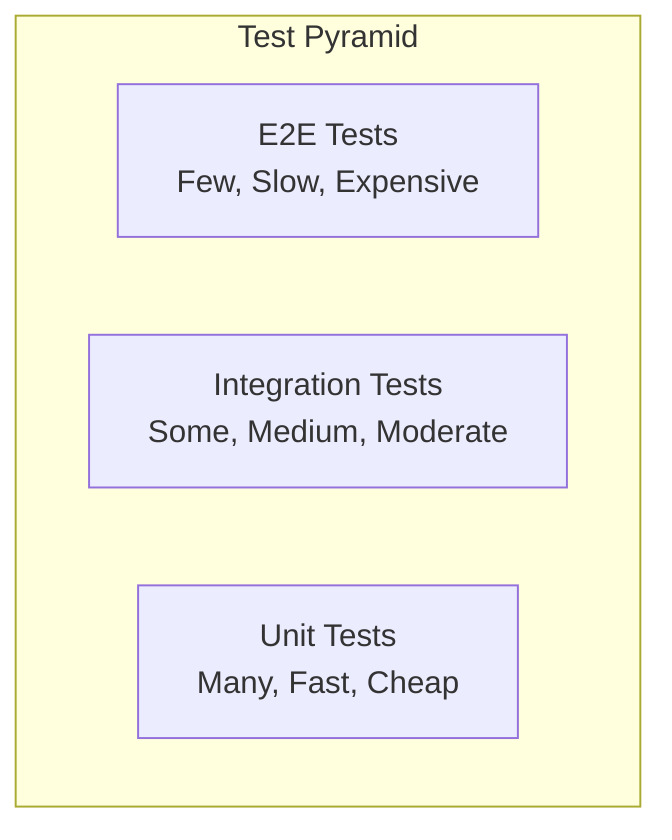

# Testing Documentation

This document provides comprehensive information about the testing strategy and implementation for the What's for Dinner application.

## Table of Contents

- [Overview](#overview)
- [Testing Strategy](#testing-strategy)
- [Test Types](#test-types)
- [Test Configuration](#test-configuration)
- [Running Tests](#running-tests)
- [Writing Tests](#writing-tests)
- [Test Data Management](#test-data-management)
- [CI/CD Integration](#cicd-integration)
- [Performance Testing](#performance-testing)
- [Mobile Testing](#mobile-testing)
- [Accessibility Testing](#accessibility-testing)
- [Best Practices](#best-practices)

## Overview

The What's for Dinner application uses a comprehensive testing strategy that includes unit tests, integration tests, end-to-end tests, and performance tests. Our testing approach ensures code quality, reliability, and maintainability.

### Testing Philosophy

- **Test-Driven Development (TDD)**: Write tests before implementing features
- **Comprehensive Coverage**: Aim for 90%+ code coverage
- **Fast Feedback**: Tests should run quickly and provide immediate feedback
- **Reliable**: Tests should be deterministic and not flaky
- **Maintainable**: Tests should be easy to understand and maintain

## Testing Strategy

### Test Pyramid



### Testing Levels

1. **Unit Tests**: Test individual functions and components
2. **Integration Tests**: Test interactions between components
3. **End-to-End Tests**: Test complete user workflows
4. **Performance Tests**: Test system performance under load
5. **Security Tests**: Test security vulnerabilities
6. **Accessibility Tests**: Test accessibility compliance

## Test Types

### Unit Tests

Unit tests verify that individual functions, methods, and components work correctly in isolation.

**Framework**: Jest + React Testing Library

```typescript
// Example Unit Test
import { render, screen, fireEvent } from '@testing-library/react';
import { MealCard } from '../MealCard';

describe('MealCard', () => {
  const mockMeal = {
    id: '1',
    name: 'Vegetarian Pasta',
    description: 'Delicious pasta with vegetables',
    category: 'dinner',
    difficulty: 'easy',
    cooking_time: 30,
    servings: 4
  };

  it('renders meal information correctly', () => {
    render(<MealCard meal={mockMeal} />);
    
    expect(screen.getByText('Vegetarian Pasta')).toBeInTheDocument();
    expect(screen.getByText('Delicious pasta with vegetables')).toBeInTheDocument();
    expect(screen.getByText('30 min')).toBeInTheDocument();
    expect(screen.getByText('4 servings')).toBeInTheDocument();
  });

  it('calls onSelect when clicked', () => {
    const onSelect = jest.fn();
    render(<MealCard meal={mockMeal} onSelect={onSelect} />);
    
    fireEvent.click(screen.getByRole('button'));
    expect(onSelect).toHaveBeenCalledWith(mockMeal);
  });
});
```

### Integration Tests

Integration tests verify that different parts of the application work together correctly.

**Framework**: Jest + Supertest

```typescript
// Example Integration Test
import request from 'supertest';
import { app } from '../app';
import { createTestUser, createTestMeal } from '../test-utils';

describe('Meal API Integration', () => {
  let authToken: string;
  let userId: string;

  beforeEach(async () => {
    const user = await createTestUser();
    userId = user.id;
    authToken = user.token;
  });

  it('should create a new meal', async () => {
    const mealData = {
      name: 'Test Meal',
      description: 'A test meal',
      category: 'dinner',
      difficulty: 'easy',
      cooking_time: 30,
      servings: 4,
      ingredients: [
        { name: 'pasta', amount: '500g', unit: 'grams' }
      ],
      instructions: ['Cook pasta according to package directions']
    };

    const response = await request(app)
      .post('/api/v2/meals')
      .set('Authorization', `Bearer ${authToken}`)
      .send(mealData)
      .expect(201);

    expect(response.body.success).toBe(true);
    expect(response.body.data.name).toBe('Test Meal');
  });

  it('should get meals with filtering', async () => {
    await createTestMeal({ category: 'dinner', difficulty: 'easy' });
    await createTestMeal({ category: 'lunch', difficulty: 'hard' });

    const response = await request(app)
      .get('/api/v2/meals?category=dinner&difficulty=easy')
      .set('Authorization', `Bearer ${authToken}`)
      .expect(200);

    expect(response.body.data.meals).toHaveLength(1);
    expect(response.body.data.meals[0].category).toBe('dinner');
  });
});
```

### End-to-End Tests

E2E tests verify complete user workflows from start to finish.

**Framework**: Playwright

```typescript
// Example E2E Test
import { test, expect } from '@playwright/test';

test.describe('Meal Generation Flow', () => {
  test('should generate meals based on user preferences', async ({ page }) => {
    // Navigate to the app
    await page.goto('/');

    // Login
    await page.click('[data-testid="login-button"]');
    await page.fill('[data-testid="email-input"]', 'test@example.com');
    await page.fill('[data-testid="password-input"]', 'password123');
    await page.click('[data-testid="login-submit"]');

    // Navigate to meal generation
    await page.click('[data-testid="generate-meals-button"]');

    // Set preferences
    await page.selectOption('[data-testid="dietary-select"]', 'vegetarian');
    await page.selectOption('[data-testid="difficulty-select"]', 'easy');
    await page.fill('[data-testid="cooking-time-input"]', '30');

    // Generate meals
    await page.click('[data-testid="generate-button"]');

    // Wait for results
    await page.waitForSelector('[data-testid="meal-card"]');

    // Verify results
    const mealCards = await page.locator('[data-testid="meal-card"]');
    await expect(mealCards).toHaveCount(3);

    // Verify meal details
    const firstMeal = mealCards.first();
    await expect(firstMeal.locator('[data-testid="meal-name"]')).toBeVisible();
    await expect(firstMeal.locator('[data-testid="meal-category"]')).toContainText('dinner');
  });
});
```

### Performance Tests

Performance tests verify that the application meets performance requirements under load.

**Framework**: K6

```javascript
// Example Performance Test
import http from 'k6/http';
import { check, sleep } from 'k6';

export let options = {
  stages: [
    { duration: '2m', target: 100 }, // Ramp up
    { duration: '5m', target: 100 }, // Stay at 100 users
    { duration: '2m', target: 0 },   // Ramp down
  ],
  thresholds: {
    http_req_duration: ['p(95)<500'], // 95% of requests under 500ms
    http_req_failed: ['rate<0.1'],    // Error rate under 10%
  },
};

export default function() {
  // Test meal generation endpoint
  let response = http.post('https://api.whats-for-dinner.com/api/v2/meals/generate', {
    preferences: {
      dietary: ['vegetarian'],
      difficulty: 'easy',
      cooking_time: 30
    }
  }, {
    headers: {
      'Authorization': 'Bearer ' + __ENV.AUTH_TOKEN,
      'Content-Type': 'application/json',
    },
  });

  check(response, {
    'status is 200': (r) => r.status === 200,
    'response time < 500ms': (r) => r.timings.duration < 500,
    'has meals': (r) => JSON.parse(r.body).data.meals.length > 0,
  });

  sleep(1);
}
```

### Mobile Tests

Mobile tests verify that the mobile application works correctly on different devices and platforms.

**Framework**: Detox

```javascript
// Example Mobile Test
describe('Meal Generation', () => {
  beforeAll(async () => {
    await device.launchApp();
  });

  beforeEach(async () => {
    await device.reloadReactNative();
  });

  it('should generate meals on mobile', async () => {
    // Login
    await element(by.id('login-button')).tap();
    await element(by.id('email-input')).typeText('test@example.com');
    await element(by.id('password-input')).typeText('password123');
    await element(by.id('login-submit')).tap();

    // Navigate to meal generation
    await element(by.id('generate-meals-button')).tap();

    // Set preferences
    await element(by.id('dietary-select')).tap();
    await element(by.text('Vegetarian')).tap();
    
    await element(by.id('difficulty-select')).tap();
    await element(by.text('Easy')).tap();

    // Generate meals
    await element(by.id('generate-button')).tap();

    // Wait for results
    await waitFor(element(by.id('meal-card')))
      .toBeVisible()
      .withTimeout(10000);

    // Verify results
    await expect(element(by.id('meal-card'))).toBeVisible();
  });
});
```

### Accessibility Tests

Accessibility tests verify that the application is accessible to users with disabilities.

**Framework**: Axe + Playwright

```typescript
// Example Accessibility Test
import { test, expect } from '@playwright/test';
import AxeBuilder from '@axe-core/playwright';

test.describe('Accessibility Tests', () => {
  test('should not have accessibility violations', async ({ page }) => {
    await page.goto('/');
    
    const accessibilityScanResults = await new AxeBuilder({ page }).analyze();
    
    expect(accessibilityScanResults.violations).toEqual([]);
  });

  test('should be keyboard navigable', async ({ page }) => {
    await page.goto('/');
    
    // Test keyboard navigation
    await page.keyboard.press('Tab');
    await expect(page.locator(':focus')).toBeVisible();
    
    await page.keyboard.press('Tab');
    await expect(page.locator(':focus')).toBeVisible();
  });

  test('should have proper ARIA labels', async ({ page }) => {
    await page.goto('/');
    
    const buttons = page.locator('button');
    const buttonCount = await buttons.count();
    
    for (let i = 0; i < buttonCount; i++) {
      const button = buttons.nth(i);
      const ariaLabel = await button.getAttribute('aria-label');
      const textContent = await button.textContent();
      
      expect(ariaLabel || textContent).toBeTruthy();
    }
  });
});
```

## Test Configuration

### Jest Configuration

```javascript
// jest.config.js
module.exports = {
  preset: 'ts-jest',
  testEnvironment: 'jsdom',
  setupFilesAfterEnv: ['<rootDir>/src/setupTests.ts'],
  moduleNameMapping: {
    '^@/(.*)$': '<rootDir>/src/$1',
  },
  collectCoverageFrom: [
    'src/**/*.{ts,tsx}',
    '!src/**/*.d.ts',
    '!src/**/*.stories.{ts,tsx}',
  ],
  coverageThreshold: {
    global: {
      branches: 80,
      functions: 80,
      lines: 80,
      statements: 80,
    },
  },
  testMatch: [
    '<rootDir>/src/**/__tests__/**/*.{ts,tsx}',
    '<rootDir>/src/**/*.{test,spec}.{ts,tsx}',
  ],
};
```

### Playwright Configuration

```typescript
// playwright.config.ts
import { defineConfig, devices } from '@playwright/test';

export default defineConfig({
  testDir: './tests/e2e',
  fullyParallel: true,
  forbidOnly: !!process.env.CI,
  retries: process.env.CI ? 2 : 0,
  workers: process.env.CI ? 1 : undefined,
  reporter: 'html',
  use: {
    baseURL: 'http://localhost:3000',
    trace: 'on-first-retry',
  },
  projects: [
    {
      name: 'chromium',
      use: { ...devices['Desktop Chrome'] },
    },
    {
      name: 'firefox',
      use: { ...devices['Desktop Firefox'] },
    },
    {
      name: 'webkit',
      use: { ...devices['Desktop Safari'] },
    },
    {
      name: 'Mobile Chrome',
      use: { ...devices['Pixel 5'] },
    },
    {
      name: 'Mobile Safari',
      use: { ...devices['iPhone 12'] },
    },
  ],
  webServer: {
    command: 'npm run dev',
    url: 'http://localhost:3000',
    reuseExistingServer: !process.env.CI,
  },
});
```

### K6 Configuration

```javascript
// k6.config.js
export let options = {
  stages: [
    { duration: '2m', target: 100 },
    { duration: '5m', target: 100 },
    { duration: '2m', target: 0 },
  ],
  thresholds: {
    http_req_duration: ['p(95)<500'],
    http_req_failed: ['rate<0.1'],
  },
};
```

## Running Tests

### Local Development

```bash
# Run all tests
npm test

# Run specific test types
npm run test:unit
npm run test:integration
npm run test:e2e
npm run test:performance
npm run test:mobile
npm run test:accessibility

# Run tests with coverage
npm run test:coverage

# Run tests in watch mode
npm run test:watch

# Run specific test file
npm test -- MealCard.test.tsx

# Run tests matching pattern
npm test -- --testNamePattern="should render"
```

### CI/CD Pipeline

```yaml
# .github/workflows/test.yml
name: Tests
on: [push, pull_request]

jobs:
  unit-tests:
    runs-on: ubuntu-latest
    steps:
      - uses: actions/checkout@v3
      - uses: actions/setup-node@v3
        with:
          node-version: '18'
      - run: npm ci
      - run: npm run test:unit
      - uses: codecov/codecov-action@v3

  integration-tests:
    runs-on: ubuntu-latest
    services:
      postgres:
        image: postgres:15
        env:
          POSTGRES_PASSWORD: postgres
        options: >-
          --health-cmd pg_isready
          --health-interval 10s
          --health-timeout 5s
          --health-retries 5
    steps:
      - uses: actions/checkout@v3
      - uses: actions/setup-node@v3
        with:
          node-version: '18'
      - run: npm ci
      - run: npm run test:integration

  e2e-tests:
    runs-on: ubuntu-latest
    steps:
      - uses: actions/checkout@v3
      - uses: actions/setup-node@v3
        with:
          node-version: '18'
      - run: npm ci
      - run: npm run test:e2e
```

## Writing Tests

### Test Structure

```typescript
// Test file structure
describe('ComponentName', () => {
  // Setup
  beforeEach(() => {
    // Setup code
  });

  afterEach(() => {
    // Cleanup code
  });

  describe('when condition', () => {
    it('should do something', () => {
      // Test implementation
    });
  });
});
```

### Test Data Management

```typescript
// test-utils.ts
export const createTestUser = async (overrides = {}) => {
  const userData = {
    email: 'test@example.com',
    password: 'password123',
    name: 'Test User',
    ...overrides
  };

  const response = await request(app)
    .post('/api/v2/auth/register')
    .send(userData);

  return response.body.data;
};

export const createTestMeal = async (overrides = {}) => {
  const mealData = {
    name: 'Test Meal',
    description: 'A test meal',
    category: 'dinner',
    difficulty: 'easy',
    cooking_time: 30,
    servings: 4,
    ingredients: [
      { name: 'pasta', amount: '500g', unit: 'grams' }
    ],
    instructions: ['Cook pasta according to package directions'],
    ...overrides
  };

  const response = await request(app)
    .post('/api/v2/meals')
    .send(mealData);

  return response.body.data;
};
```

### Mocking

```typescript
// Mock external services
jest.mock('@supabase/supabase-js', () => ({
  createClient: jest.fn(() => ({
    from: jest.fn(() => ({
      select: jest.fn(() => ({
        eq: jest.fn(() => ({
          single: jest.fn(() => Promise.resolve({ data: mockUser, error: null }))
        }))
      }))
    }))
  }))
}));

// Mock API calls
global.fetch = jest.fn(() =>
  Promise.resolve({
    json: () => Promise.resolve({ data: mockData }),
    ok: true,
    status: 200
  })
);
```

## Test Data Management

### Test Database

```typescript
// test-database.ts
export const setupTestDatabase = async () => {
  // Create test database
  await createTestDatabase();
  
  // Run migrations
  await runMigrations();
  
  // Seed test data
  await seedTestData();
};

export const cleanupTestDatabase = async () => {
  // Clean up test data
  await cleanupTestData();
  
  // Drop test database
  await dropTestDatabase();
};
```

### Test Data Factories

```typescript
// test-factories.ts
export const userFactory = (overrides = {}) => ({
  id: faker.datatype.uuid(),
  email: faker.internet.email(),
  name: faker.name.fullName(),
  password_hash: faker.internet.password(),
  role: 'user',
  created_at: faker.date.past(),
  updated_at: faker.date.recent(),
  ...overrides
});

export const mealFactory = (overrides = {}) => ({
  id: faker.datatype.uuid(),
  name: faker.lorem.words(3),
  description: faker.lorem.sentence(),
  category: faker.helpers.arrayElement(['breakfast', 'lunch', 'dinner', 'snack']),
  difficulty: faker.helpers.arrayElement(['easy', 'medium', 'hard']),
  cooking_time: faker.datatype.number({ min: 15, max: 120 }),
  servings: faker.datatype.number({ min: 1, max: 8 }),
  ingredients: [
    {
      name: faker.lorem.word(),
      amount: faker.datatype.number({ min: 1, max: 500 }),
      unit: faker.helpers.arrayElement(['g', 'ml', 'cups', 'tbsp'])
    }
  ],
  instructions: [faker.lorem.sentence(), faker.lorem.sentence()],
  created_at: faker.date.past(),
  updated_at: faker.date.recent(),
  ...overrides
});
```

## CI/CD Integration

### GitHub Actions

```yaml
# .github/workflows/test.yml
name: Test Suite
on: [push, pull_request]

jobs:
  test:
    runs-on: ubuntu-latest
    strategy:
      matrix:
        node-version: [18, 20]
    
    steps:
      - uses: actions/checkout@v3
      
      - name: Use Node.js ${{ matrix.node-version }}
        uses: actions/setup-node@v3
        with:
          node-version: ${{ matrix.node-version }}
          cache: 'npm'
      
      - name: Install dependencies
        run: npm ci
      
      - name: Run unit tests
        run: npm run test:unit
      
      - name: Run integration tests
        run: npm run test:integration
      
      - name: Run E2E tests
        run: npm run test:e2e
      
      - name: Upload coverage reports
        uses: codecov/codecov-action@v3
        with:
          file: ./coverage/lcov.info
```

### Test Reports

```typescript
// jest.config.js
module.exports = {
  reporters: [
    'default',
    ['jest-html-reporters', {
      publicPath: './test-results',
      filename: 'report.html',
      openReport: true,
    }],
    ['jest-junit', {
      outputDirectory: './test-results',
      outputName: 'junit.xml',
    }],
  ],
};
```

## Performance Testing

### Load Testing

```javascript
// load-test.js
import http from 'k6/http';
import { check, sleep } from 'k6';

export let options = {
  stages: [
    { duration: '2m', target: 100 },
    { duration: '5m', target: 100 },
    { duration: '2m', target: 0 },
  ],
  thresholds: {
    http_req_duration: ['p(95)<500'],
    http_req_failed: ['rate<0.1'],
  },
};

export default function() {
  let response = http.get('https://api.whats-for-dinner.com/api/v2/meals');
  check(response, {
    'status is 200': (r) => r.status === 200,
    'response time < 500ms': (r) => r.timings.duration < 500,
  });
  sleep(1);
}
```

### Stress Testing

```javascript
// stress-test.js
import http from 'k6/http';
import { check, sleep } from 'k6';

export let options = {
  stages: [
    { duration: '2m', target: 1000 },
    { duration: '5m', target: 1000 },
    { duration: '2m', target: 0 },
  ],
  thresholds: {
    http_req_duration: ['p(95)<1000'],
    http_req_failed: ['rate<0.2'],
  },
};

export default function() {
  let response = http.post('https://api.whats-for-dinner.com/api/v2/meals/generate', {
    preferences: {
      dietary: ['vegetarian'],
      difficulty: 'easy',
      cooking_time: 30
    }
  });
  
  check(response, {
    'status is 200': (r) => r.status === 200,
    'response time < 1000ms': (r) => r.timings.duration < 1000,
  });
  sleep(1);
}
```

## Mobile Testing

### Detox Configuration

```javascript
// .detoxrc.js
module.exports = {
  testRunner: 'jest',
  runnerConfig: 'e2e/config.json',
  configurations: {
    'ios.sim.debug': {
      binaryPath: 'ios/build/Build/Products/Debug-iphonesimulator/WhatsForDinner.app',
      build: 'xcodebuild -workspace ios/WhatsForDinner.xcworkspace -scheme WhatsForDinner -configuration Debug -sdk iphonesimulator -derivedDataPath ios/build',
      type: 'ios.simulator',
      device: {
        type: 'iPhone 14',
      },
    },
    'android.emu.debug': {
      binaryPath: 'android/app/build/outputs/apk/debug/app-debug.apk',
      build: 'cd android && ./gradlew assembleDebug assembleAndroidTest -DtestBuildType=debug',
      type: 'android.emulator',
      device: {
        avdName: 'Pixel_4_API_30',
      },
    },
  },
};
```

### Mobile Test Examples

```javascript
// e2e/mealGeneration.e2e.js
describe('Meal Generation', () => {
  beforeAll(async () => {
    await device.launchApp();
  });

  beforeEach(async () => {
    await device.reloadReactNative();
  });

  it('should generate meals on mobile', async () => {
    // Test implementation
  });
});
```

## Accessibility Testing

### Axe Configuration

```typescript
// accessibility.config.ts
export const axeConfig = {
  rules: {
    'color-contrast': { enabled: true },
    'keyboard-navigation': { enabled: true },
    'screen-reader': { enabled: true },
  },
  tags: ['wcag2a', 'wcag2aa', 'wcag21aa'],
};
```

### Accessibility Test Examples

```typescript
// accessibility.test.ts
import { test, expect } from '@playwright/test';
import AxeBuilder from '@axe-core/playwright';

test.describe('Accessibility', () => {
  test('should not have accessibility violations', async ({ page }) => {
    await page.goto('/');
    
    const accessibilityScanResults = await new AxeBuilder({ page })
      .withTags(['wcag2a', 'wcag2aa'])
      .analyze();
    
    expect(accessibilityScanResults.violations).toEqual([]);
  });
});
```

## Best Practices

### Test Organization

1. **Group related tests** using `describe` blocks
2. **Use descriptive test names** that explain what is being tested
3. **Follow the AAA pattern**: Arrange, Act, Assert
4. **Keep tests independent** and avoid dependencies between tests
5. **Use meaningful assertions** that clearly express the expected behavior

### Test Data

1. **Use factories** for creating test data
2. **Keep test data minimal** and focused on what's being tested
3. **Use realistic data** that represents real-world scenarios
4. **Clean up test data** after each test
5. **Use constants** for repeated test data

### Mocking

1. **Mock external dependencies** to isolate the code under test
2. **Use dependency injection** to make mocking easier
3. **Mock at the right level** - not too high, not too low
4. **Verify mock interactions** when necessary
5. **Keep mocks simple** and focused

### Performance

1. **Run tests in parallel** when possible
2. **Use test databases** for integration tests
3. **Mock slow operations** in unit tests
4. **Use test data builders** to avoid complex setup
5. **Clean up resources** after tests

### Maintenance

1. **Update tests** when requirements change
2. **Refactor tests** to keep them maintainable
3. **Remove obsolete tests** that are no longer relevant
4. **Document complex test scenarios** with comments
5. **Review test coverage** regularly

---

This testing documentation provides a comprehensive guide to testing the What's for Dinner application. For more specific information about individual test types or configurations, refer to the relevant sections above.